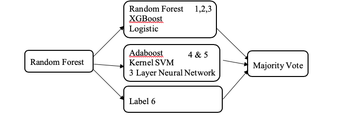
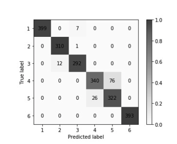
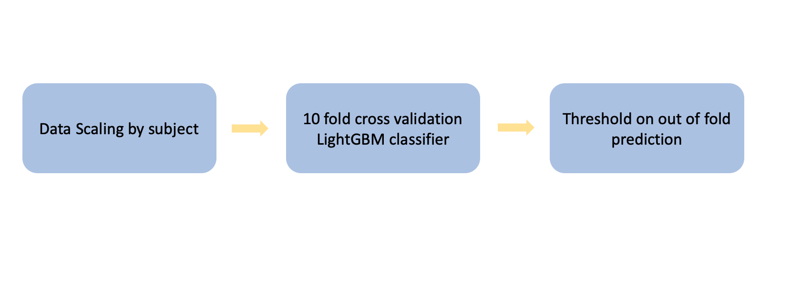

# Machine-Learning-inclass-competition

### Overview

The goal of this competition is to predict human activity based on data recorded from a smartphone. The data consists of a time series for each of 30 volunteers collected via an accelerometer and gyroscope on a smartphone and manually labeled with the type of activity performed. Activities include walking, walking upstairs, walking downstairs, sitting, standing, and laying. Numerical evaluation for the competition is based on classification accuracy.

### Old approach

The following approach is the approach I did buring the competition. Random forast is applied first to classified data into three groups. one is label 1,2,3 corresponds to static motion, label 4,5 and 6 corresponds activate motion. Than several model are train on those groups and combine for the final prediction.

### New approach

While I was looking trough my old code I found this old project which is the first machine learning project I have ever done. It woud be intersting to see what kind of approach will I do after learning a lot more so the ipython notebook is what I did for and afternoon. Somehow achive better result with less complicate model with out of fold ensemble.

